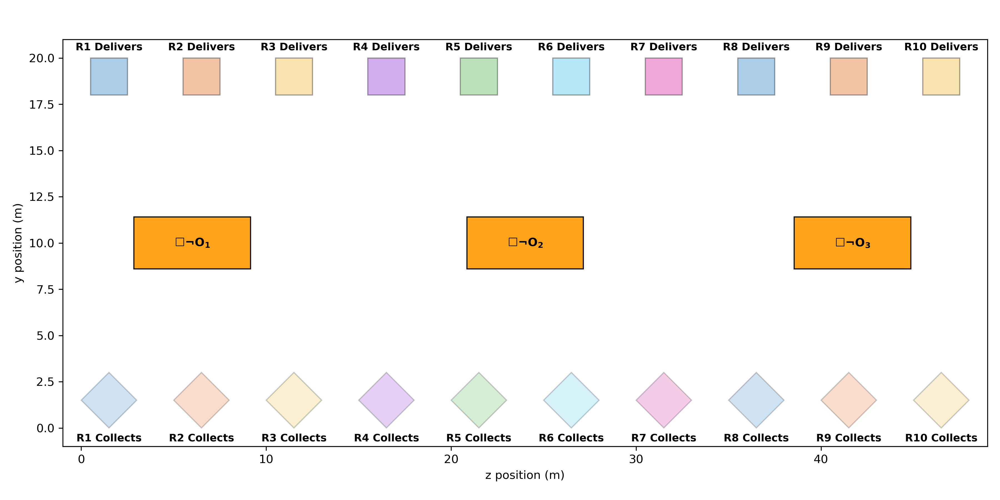
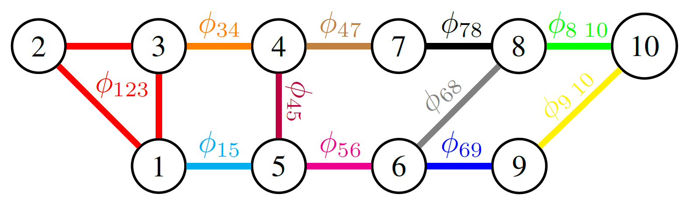

# Ten-Robot SLT Motion Planning (Numerical Validation)

We evaluate the **BCGD-PM** (Block Coordinate Gradient Descent - Penalty Method) framework using a complex multi-agent motion planning scenario. We compare its performance against traditional Mixed-Integer Programming (MIP) approaches across various task specifications as well as linear and unicycle dynamical models.

---

## Problem Description
The evaluation considers a ten-robot workspace containing three obstacles ($\mathcal{O}_1, \mathcal{O}_2, \mathcal{O}_3$), ten collection regions ($C_i$), and ten delivery regions ($D_i$). 

  
   
  <em>Figure: Workspace</em>

In the most challenging case, robots $(Ri)$ must satisfy a complex Signal Temporal Logic (STL) task:
* **Reachability:** Visit collection region $C_i$ and delivery region $D_i$ within specific time intervals.
* **Safety:** Avoid all obstacles $\mathcal{O}_l$ and maintain inter-agent collision avoidance.
* **Collaboration:** Meet peers belonging to the same cliques within the 100-step time horizon. 

### Robot Dynamics
We test performance under discrete-time **linear dynamics** as well as **unicycle dynamics** for each robot $i$ with discretization interval $\Delta t=1$ time unit:

**Linear Case (Single Integrator):**
In this simplified setup, the control inputs directly dictate the change in position.
* **State:** $x_i(t) = (z_i(t), y_i(t)) \in \mathbb{R}^2$ (Cartesian position).
* **Controls:** $u_i(t) = (u_{i,1}(t), u_{i,2}(t)) \in \mathbb{R}^2$ (velocity inputs).
* **Equations:** $x_i(t+1) = x_i(t) + \Delta t u_i(t)$

**Unicycle case:**
In this model, the robot's movement is restricted by its heading.
* **State:** $x_i(t)=(z_i(t), y_i(t)) \in \mathbb{R}^2$ (Cartesian position) and $\theta_i(t) \in \mathbb{R}$ (heading).
* **Controls:** $v_i(t)$ (linear velocity) and $\omega_i(t)$ (angular velocity).
* **Equations:**
$z_i(t+1)=z_i(t)+\Delta t v_i(t)\cos\theta_i(t)$, $y_i(t+1)=y_i(t)+\Delta t v_i(t)\sin\theta_i(t)$, and $\theta_i(t+1)=\theta_i(t)+\Delta t\omega_i(t)$

### Cost Function: $\mathcal{L}(u)=\sum_i \mathcal{L}_i(u_i)$:
To retain convexity of $\mathcal{L}_i$ we penalize only control effort setting 

$$\mathcal{L}_i(u_i) = \sum_{t=0}^{N-1} \ell_i(u_i(t),t)$$

* **Linear case:** $\ell_i(u_i(t),t)=u_{i,1}(t)^2+u_{i,2}(t)^2$

* **Unicycle case:** $\ell_i(u_i(t),t)=(w_1 v_i(t))^2+(w_2 \omega_i(t))^2$, where $w_1$ and $w_2$ are weighting factors balancing the emphasis between linear and angular velocity control effort.

### Collaborative Task Topology & Cliques $\nu \in \mathcal{K}_\phi$
The figure below illustrates the collaborative formulas $\phi_\nu$ defined for cliques of agents. Each node represents a robot, and colored edges represent specific joint (meeting) STL tasks.

  
   
  <em>Figure: Collaborative-task graph for the ten-robot system.</em>

---

## Multi-Agent STL scenarios
### Baseline specification **R2AM** (Reach-twice-Avoid-Meet):
1.  **Avoid Obstacles:** $\square_{\mathcal{I}}\neg \mathcal{O}_l$ for all time.
2.  **Collect:** Visit region $C_i$ within $t \in [10, 50]$.
3.  **Deliver:** Reach region $D_i$ within $t \in [70, 100]$.
4.  **Collaborative Meeting:** Robots belonging to the same clique $\nu$ are required to approach each other within a distance of $0.25$ units during the interval $t \in [0, 70]$. The collaborative predicate for a clique is defined as:
$$M_\nu \coloneqq \left( \min_{\kappa \in \nu} \mu_\kappa(x_\kappa) \geq 0 \right)$$

where:
* $x_\kappa = (z_q, y_q)_{q \in \kappa}$ represents the concatenated positions of the agents in team $\kappa$.
* $\kappa = (i, j) \subseteq \nu$ denotes any pair of robots within the clique.
* The predicate function is:  $\mu_\kappa(x_\kappa) = 0.25 - \left\| [I \quad -I] x_\kappa \right\|_2$

### **R2AMCA** (R2AM + Collision Avoidance)
We extend the baseline **R2AM** specification by incorporating inter-agent safety constraints:

1. **Inter-agent Collision Avoidance:** For every pair of agents $(i, j)$, a minimum safety distance must be maintained globally:
   $$\|x_i(t) - x_j(t)\|_2 \geq 0.01, \quad \forall t \in [0, 100]$$
2. **Baseline Requirements:** Retains all Obstacle Avoidance, Collection, Delivery, and Collaborative Meeting constraints from the R2AM baseline.

### **RURAMCA** (Reach-Until-Reach + Meet + Collision Avoidance)
This scenario introduces more complex temporal dependencies by replacing simple reachability with the **Until** ($\mathcal{U}$) operator.

1. **Reach-Until-Reach Task:** Each robot $i$ must visit the collection region $C_i$ *until* it moves toward the delivery goal $D_i$, specified as
 
 $$(\lozenge_{[10,50]} C_i) U_{[0,50]} (\lozenge_{[10,50]} D_i)$$

3. **Collaboration and Safety:** All collaborative meeting requirements as well as global inter-agent collision avoidance and obstacle avoidance constraints are retained from **R2AMCA**.

---

## 3. Performance Comparison
The following table compares the computational runtime (in seconds) between our proposed **BCGD-PM** method and the **MIP** baseline. All benchmarks were performed on a laptop equipped with a 13th Gen Intel(R) Core(TM) i7-1365U (1.80 GHz) processor and 16.0 GB RAM, running a 64-bit operating system.

---

| Scenario | Dynamics | BCGD-PM (Ours) | MIP [1, 2] |
| :--- | :--- | :--- | :--- |
| **R2AM** | Linear | **345s** | 425s |
| **R2AMCA** | Linear | **1291s** | > 2000s |
| **RURAMCA** | Linear | **1740s** | > 10000s |
| **R2AM** | Unicycle | **820s** | N/A |
| **R2AMCA** | Unicycle | **1852s** | N/A |
| **RURAMCA** | Unicycle | **2326s** | N/A |

---

## 4. Parameter Selection & Implementation Details
The algorithm is implemented in **Python**, leveraging **JAX** for hardware-accelerated automatic differentiation.

* **Smoothing Parameter ($\Gamma$):** Note that as $\Gamma \to \infty$, the smooth robustness $\varrho_\Gamma^\phi(u)$ converges to the non-smooth robustness $\rho^\phi(u)$, reducing the approximation gap. For the evaluated scenarios, we set $\Gamma=3$. 
* **Penalty Parameter ($\lambda$):** We initialize $\lambda_0 = 1$ with an update factor $\eta_\lambda = 5$. Empirically, starting with a small $\lambda > 0$ yields smoother, more stable trajectories, as early iterations prioritize minimizing control effort over constraint satisfaction.
* **Outer Loop (Penalty Method):** The outer loop terminates when infeasibility $R(\mathbf{u}) < \epsilon_{\mathrm{infeas}}$, where we select $\epsilon_{\mathrm{infeas}} = 5.0 \times 10^{-8}$. This tolerance implies that upon termination, the smooth robustness $\varrho_\Gamma^\phi(u) > - \sqrt{5} \times 10^{-4}$.
* **Inner Loop (BCGD):** The inner loop utilizes randomized block updates performed in epochs. We use an initial inner tolerance of $\epsilon_0 = 10^{-2}$ and an update parameter $\eta_\epsilon = 0.2$. Shuffling the agent update order at each epoch significantly aids in avoiding local minima compared to centralized penalty methods.
* **Closed-form Update Rule:** By employing a simple Hessian approximation $H^k = I$, the update direction $\mathbf{d}_i^k$ at each BCGD iteration is computed as:

  $$\mathbf{d}_i^k = - (\lambda^k + 2)^{-1} \left( 2 \mathbf{u}_i^k + \lambda^k \nabla R(\mathbf{u}^k)_i \right)$$

* **Performance:** BCGD typically converges within 2,750 updates per outer iteration (for the most challenging RURAMCA scenario). Each update incurs negligible computational overhead thanks to the JAX-based automatic differentiation and the closed-form expression for the direction update.

---

## 5. Visual Results

The following animations demonstrate the swarm behavior across the three primary mission specifications for both linear and non-linear dynamics.

### 🔹 Linear Dynamics (Single Integrator)

#### R2AM - Linear

*Baseline Reach-Avoid multi-agent mission.*

#### R2AMCA - Linear

*Reach-Avoid mission with Inter-Agent Collision Avoidance.*

#### RURAMCA - Linear

*Complex Reach-Until-Reach mission with Collision Avoidance and Collaborative Meeting.*

---

### 🔸 Unicycle Dynamics (Non-linear)

#### R2AM - Unicycle

*Baseline Reach-Avoid mission under non-linear unicycle constraints.*

#### R2AMCA - Unicycle

*Unicycle dynamics with reactive Inter-Agent Collision Avoidance.*

#### RURAMCA - Unicycle

*Full RURAMCA mission satisfaction under non-linear unicycle dynamics.*

---
