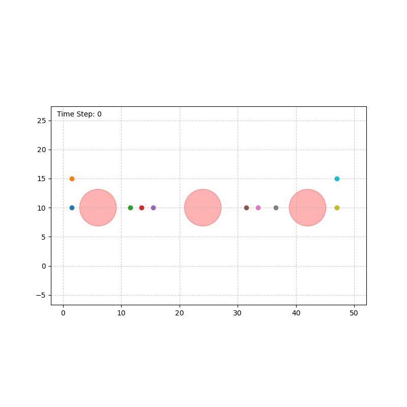

# Multi-agent STL planning with block-coordinate optimization & penalty methods
Using penalty methods with block coordinate gradient descent to solve multi-agent signal temporal logic (STL) planning problems

  
   
  
  
  

# Multi-Agent STL Planning via BCGD
This repository implements an accelerated **Block Coordinate Gradient Descent (BCGD)** solver for Signal Temporal Logic (STL) specifications.
$f(x) = x$
